# 安裝指南 — 電影資料庫管理系統

## 前置需求
需要安裝以下兩個工具：
- **XAMPP** — 提供 Apache 伺服器以執行 PHP 檔案
- **MySQL Workbench** — 提供 MySQL 客戶端以匯入資料庫結構

---

## 步驟一：安裝 XAMPP

1. 至 https://www.apachefriends.org/ 下載 XAMPP
2. 出現 UAC 警告時，點選「確定」
3. **注意：** 將安裝路徑從 `C:\Program Files\xampp` 改為 `C:\xampp`，以避免權限問題
4. 其餘設定保持預設，完成安裝

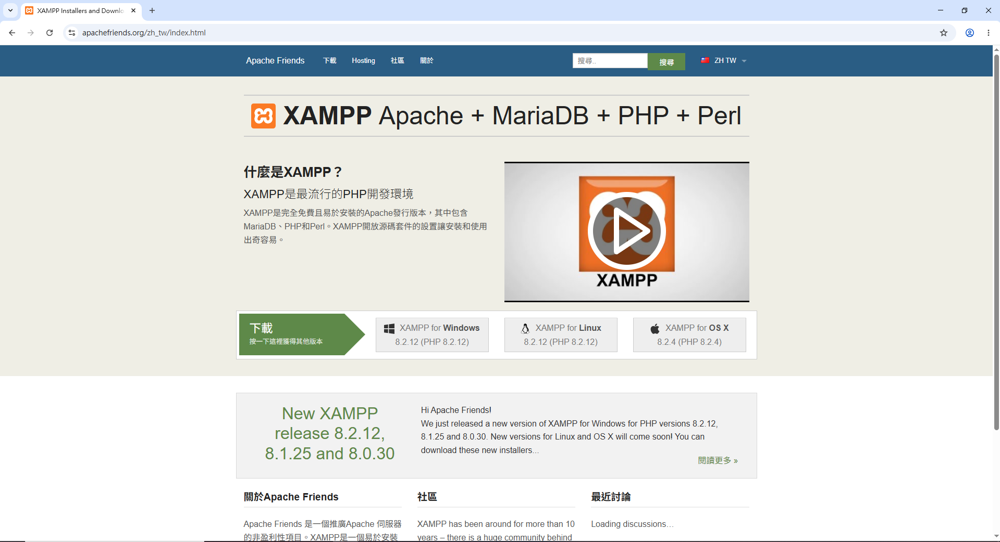
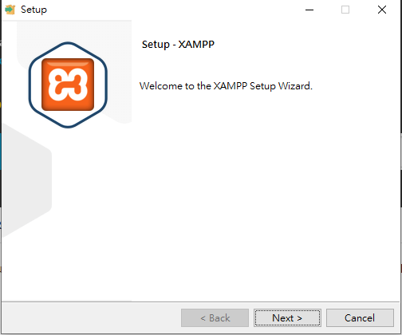
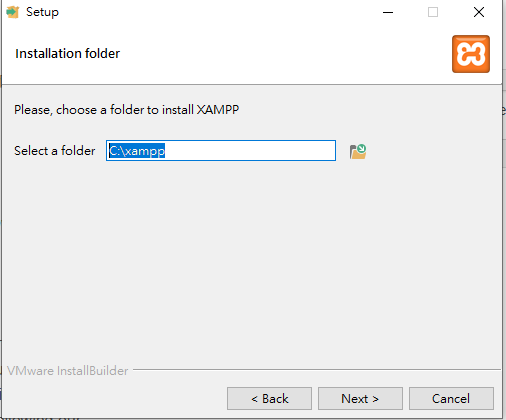
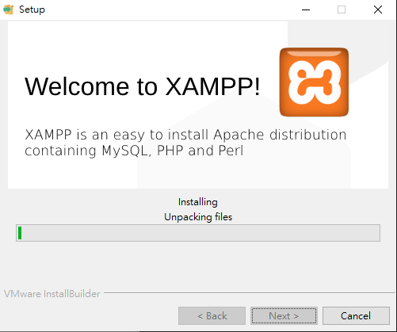
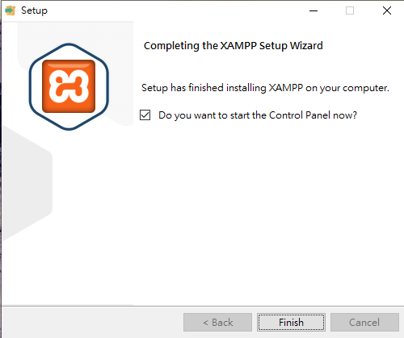

---

## 步驟二：複製專案檔案

**方法一：使用命令提示字元**

開啟命令提示字元，執行：

```cmd
xcopy /E /Y "db_movie的路徑" "C:\xampp\htdocs\db_movie\"
```


**方法二：直接剪下貼上**

開啟檔案總管，找到 `db_movie` 資料夾，按 `Ctrl+X` 剪下（或 `Ctrl+C` 複製），然後前往 `C:\xampp\htdocs\`，按 `Ctrl+V` 貼上即可。

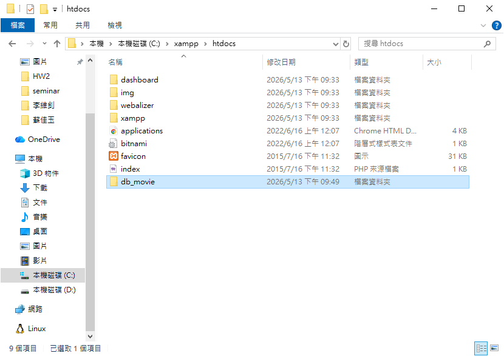

---

## 步驟三：啟動 Apache

1. 開啟 XAMPP 控制台（`C:\xampp\xampp-control.exe`）
2. 點選 **Apache** 旁的 **Start**
3. 使用應用程式時，Apache 必須保持執行中

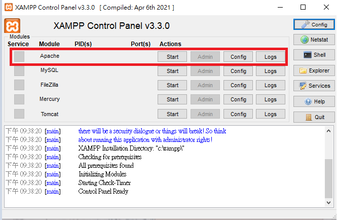
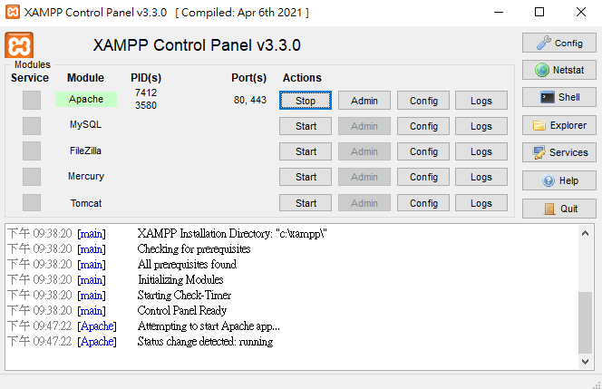

---

## 步驟四：安裝 MySQL Workbench

1. 至 https://dev.mysql.com/downloads/workbench/ 下載 MySQL Workbench
2. 點選「No thanks, just start my download」跳過帳號註冊
3. 安裝類型選擇 **Client only（僅客戶端）**
4. 完成安裝；MySQL Router 設定頁面直接點選 **Finish** 跳過

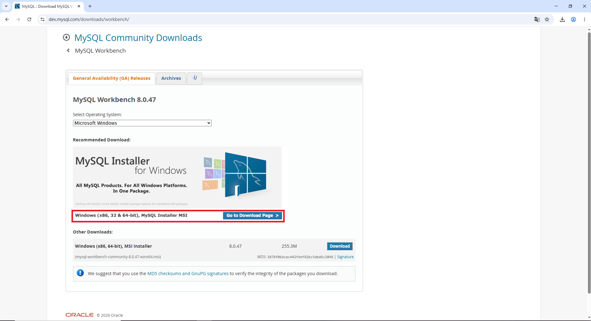
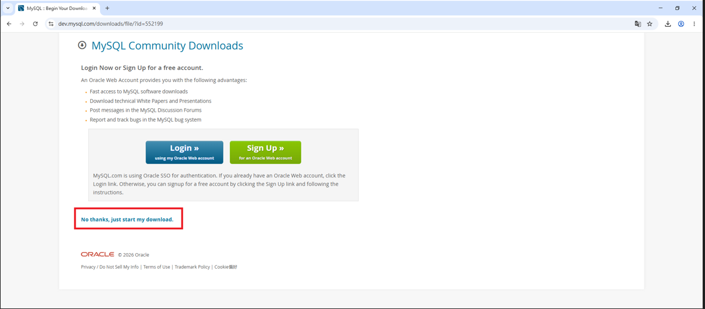
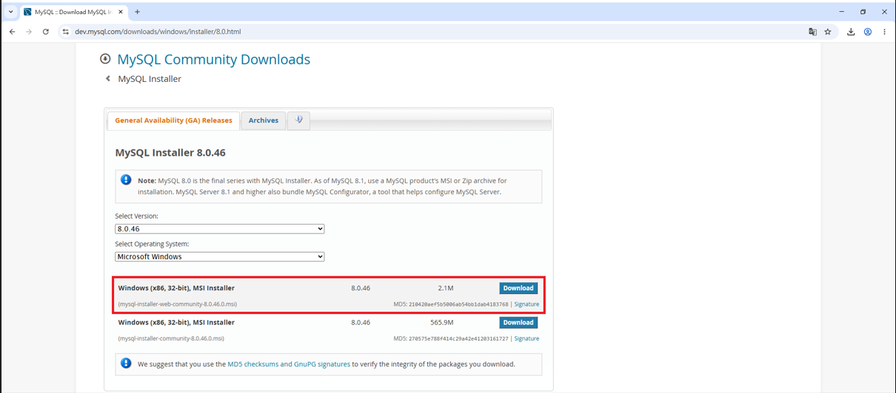
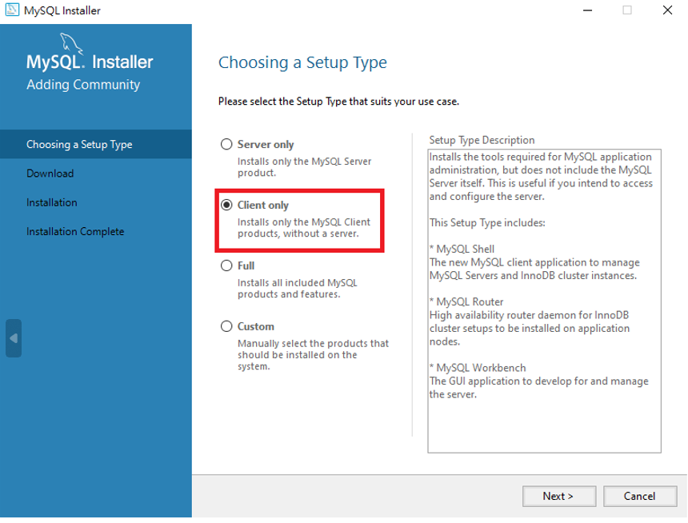
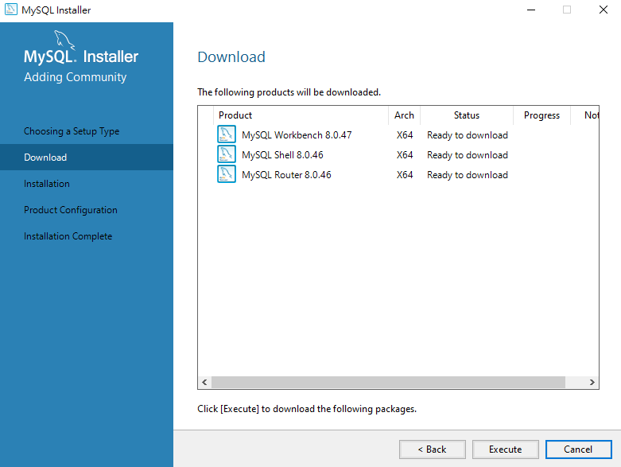

---

## 步驟五：匯入資料庫結構

1. 開啟 **MySQL Workbench**
2. 點選「MySQL Connections」旁的 **+**，填入以下資訊：
   - **Connection Name：** 任意名稱（例如 `School`）
   - **Hostname：** 遠端伺服器 IP
   - **Username：** 你的帳號
   - 點選 **Store in Vault** 輸入密碼
3. 點選 **OK** 儲存，再點選該連線進入
4. 點選 **File → Open SQL Script**，選擇 `db_data.sql` 並開啟
5. **注意：** 執行前，請修改 SQL 檔案中標有 `TODO` 的三處：
   - `USE`：改為你的**資料庫名稱**
   - `CREATE TABLE IF NOT EXISTS`：將資料表名稱改為你的**學號**（例如 `A123456789`），以避免與其他同學衝突
   - `INSERT INTO`：同樣將資料表名稱改為你的**學號**
6. 點選 **⚡ 閃電圖示**（或按 `Ctrl+Shift+Enter`）執行

這將建立你的資料表並插入初始資料。

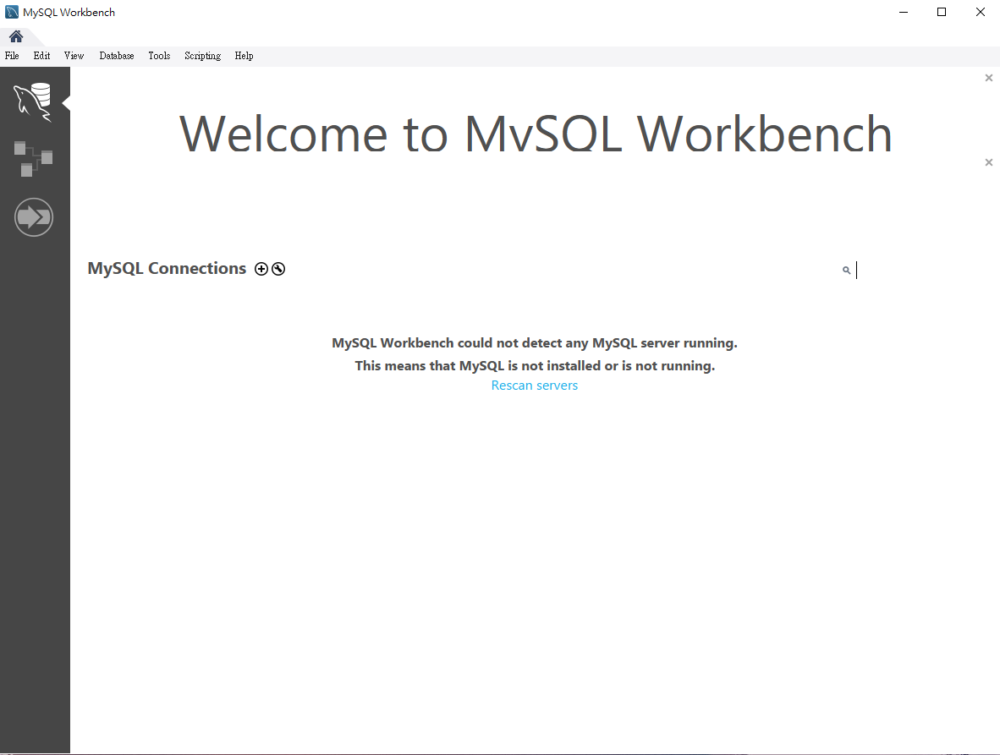
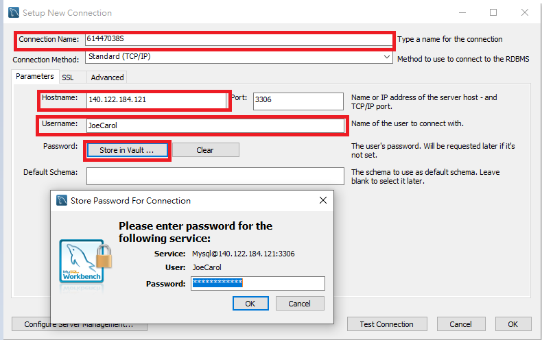
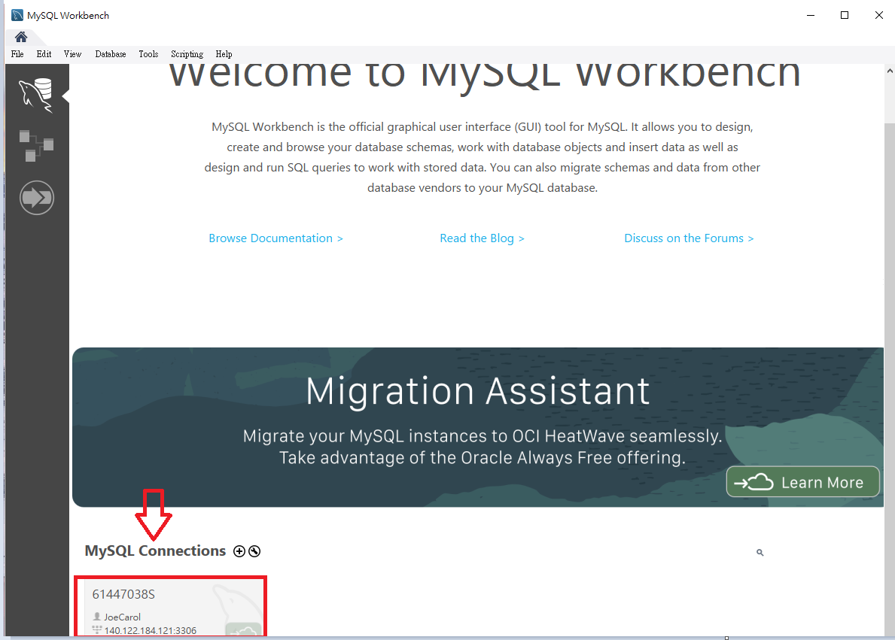
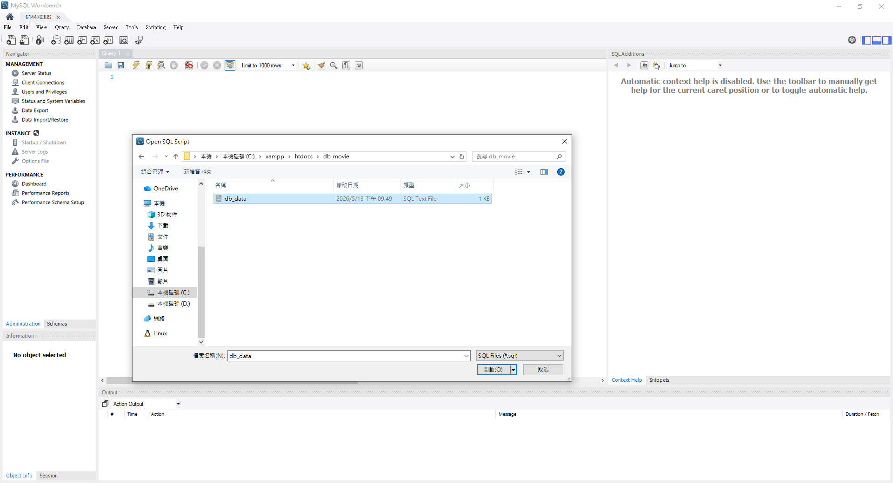
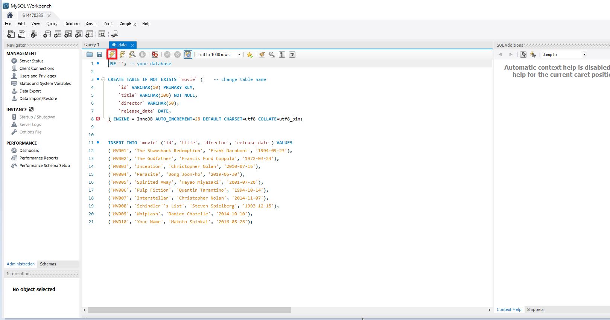

---

## 步驟六：使用應用程式

開啟瀏覽器，前往：

```
http://localhost/db_movie/
```

你可以：
- **瀏覽** 主頁上的所有電影
- **新增** 電影，點選「新增資料」
- **編輯** 電影，點選「編輯」按鈕
- **刪除** 電影，點選「刪除」按鈕

所有變更會直接儲存至遠端資料庫。

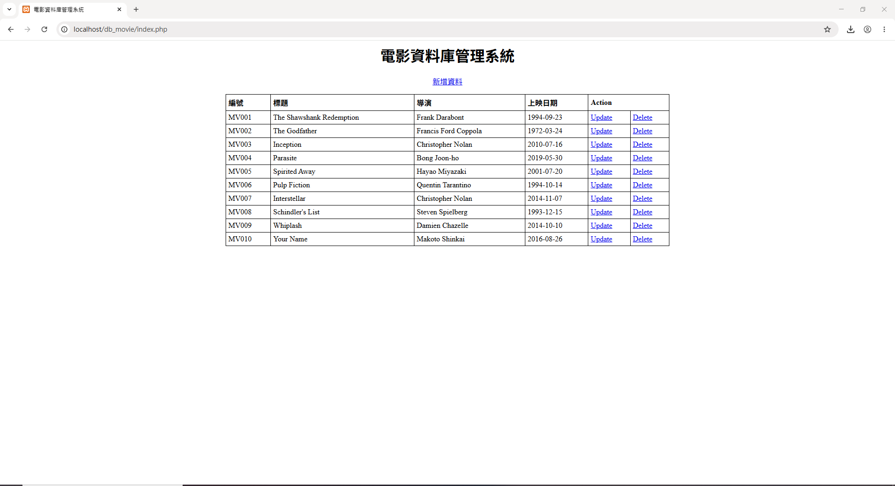

---

## 步驟七：確認變更是否儲存

可透過以下方式確認變更已儲存：
- **重新整理** `http://localhost/db_movie/`，確認變更仍存在
- **或** 開啟 MySQL Workbench，執行：
  ```sql
  SELECT * FROM table_name; #記得改為自己的table名稱
  ```
  查詢結果即為資料庫目前的狀態。

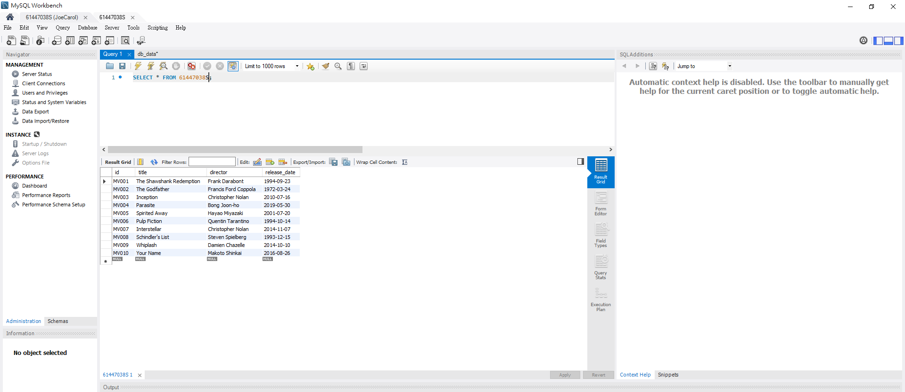
